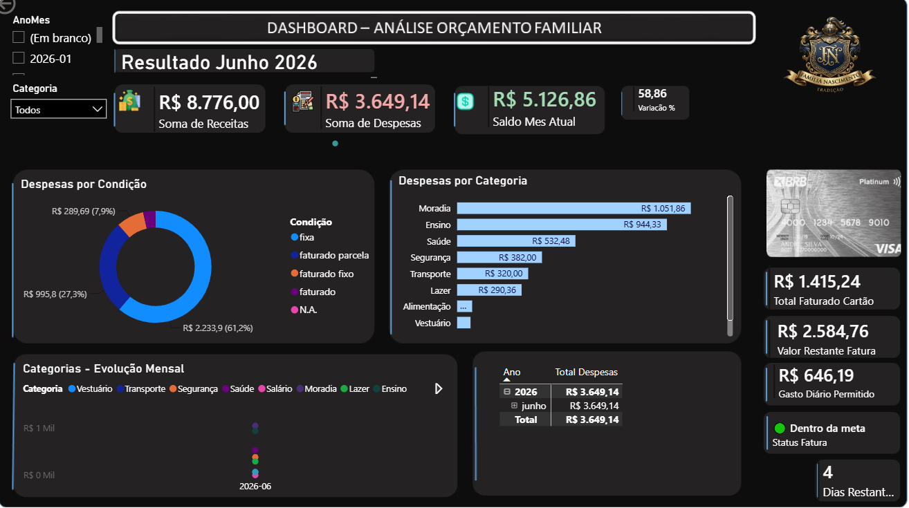

# 📊 Dashboard de Análise de Orçamento Familiar

Projeto desenvolvido em **Microsoft Power BI** para acompanhamento e análise do orçamento financeiro familiar, transformando dados de receitas e despesas em informações visuais que auxiliam no controle e na tomada de decisões.

## 🎯 Objetivo

O objetivo deste projeto é facilitar o acompanhamento das finanças familiares por meio de um dashboard interativo, permitindo visualizar receitas, despesas, saldo mensal, gastos por categoria e informações relacionadas ao cartão de crédito.

## 📈 Principais recursos

O dashboard apresenta:

- 💰 Total de receitas
- 🧾 Total de despesas
- 💵 Saldo do mês atual
- 📊 Variação percentual
- 🍩 Despesas por condição
- 📊 Despesas por categoria
- 📈 Evolução mensal das categorias
- 💳 Total faturado no cartão
- 💳 Valor restante da fatura
- 💰 Limite diário de gasto permitido
- 🟢 Indicador de status em relação à meta
- 📅 Quantidade de dias restantes
- 🔎 Filtros por período e categoria

## 🛠️ Tecnologias utilizadas

- Microsoft Power BI
- Power Query
- Modelagem e tratamento de dados
- Visualização de dados
- Análise financeira
- Google Sheets como fonte de dados

## 💡 Aprendizados

Durante o desenvolvimento deste projeto, pude aprimorar meus conhecimentos em organização, tratamento, análise e visualização de dados.

Também pratiquei a criação de indicadores e dashboards que facilitam a interpretação das informações e auxiliam na tomada de decisões.

O projeto contribuiu para meu desenvolvimento em **Business Intelligence e Análise de Dados**, complementando os conhecimentos adquiridos durante minha formação em **Análise e Desenvolvimento de Sistemas**.

## 🖼️ Visualização do Dashboard

Abaixo está uma visão geral do dashboard desenvolvido no Power BI.

## 🚀 Próximas melhorias

- Aprimorar os indicadores financeiros
- Criar novas análises comparativas entre períodos
- Expandir as visualizações
- Aperfeiçoar a experiência de navegação
- Continuar evoluindo a integração e o tratamento dos dados

---

### 👨‍💻 Autor

**Wagner Carneiro do Nascimento**

Projeto desenvolvido como parte do meu aprendizado e desenvolvimento profissional nas áreas de **Análise de Dados, Business Intelligence e Tecnologia da Informação**.
